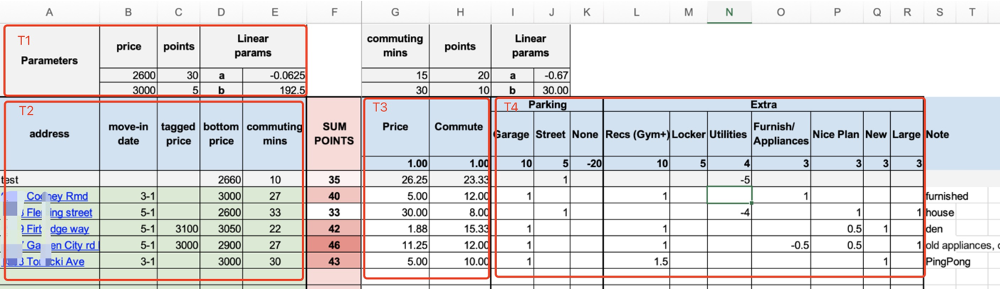

# Rental Fishpond

I had to move on May 1st, from a small town to a big city, which was exciting, but also meant I needed to start the heavy lifting and face all sorts of risks and expenses, including roommates, housing, moving, etc.

So, I started looking for a roommate in mid to early March, which went well compared to our later search for a 2b2b (2 bedrooms and 2 bathrooms) rental situation, and she was nice. It was demanding, but luckily we found a decent one and were finally able to stop looking. In addition to my roommate's diligent scouting, the tool I made helped us a lot, allowing us to quantify the screening by finding a few diamond options out of dozens of housing choices.

I believe this tool is valuable to help you make decisions when searching for the best rentals in big cities where housing is plentiful but challenging to decide with so many variables carried.

The tool can be found in this [Excel Doc](./Rental%20Fishpond.xlsx), feel free to download and customize your own settings.

In this tool, as depicted in the image above, `SUM POINTS` represents the overall score of each rental option. This metric takes into account factors such as price (`Price`), commuting convenience (`Commute`), parking facilities (`Parking`), and various other aspects (`Extra`).

The `SUM POINTS` is calculated by multiplying preset points assigned to each feature by their respective ratings in terms of the rental options. The value of points for `Price` and `Commute` is continuous and calculated using linear regression with specific predetermined settings, while the value of points for `Extra` is categorical.

`T1` is the parameter setting area for `Price` and `Commuting mins`, which is calculated with the linear formula `Price Points = a * Price + b`. The idea is that lower prices or shorter commuting times result in higher points. I set up an expected grading with the condition that if the price is $2600, then we get 30 points, and if the price is $30, then we get 5 points, to feed into `T3`.
In the `T4` area, we consider factors such as whether parking is underground or on the street or no parking place, the availability of recreational facilities like a gym, whether utilities such as electricity and water are included, the condition of the appliances, whether the place is spacious, new, or with a nice plan.

In `T4`, the respective points are generally set at "1", but some may be adjusted. For example, if a house doesn't include utilities while the utility fees are quite expensive, I set it at -4, as the cost is five times higher than an apartment in this regard. By the way, the unit points of those category features are mostly determined by comparing the cost to the price.

In `T2`, information is the static contextual ones, such as the address, links of the post, and move-in date. The tagged price is the price proposed in the post, while the bottom price is the compromise they offered us.

It's clear now, within the available options we got, that the one with the highest `SUM POINTS`, 46, is indicated by the darkest red color in this column.
