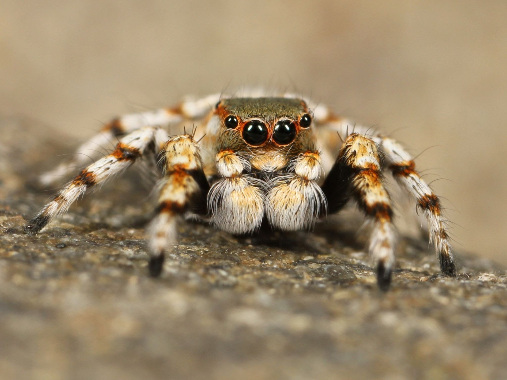
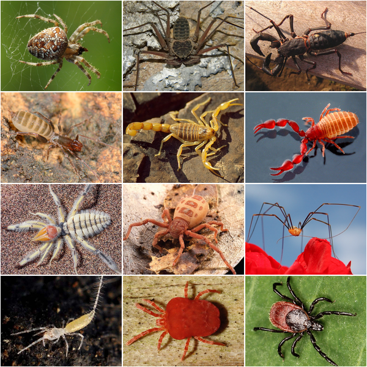

# SpatialAnalysis-Arachnida
This paper will examine the spatial first and second moment characteristics of Arachnida distribution in British Columbia and construct a Poisson Process model to forecast point distribution. We will classify the Araneae and Opiliones orders as groups to create visualizations that provide us with additional information about the Arachnida subgroups. 

Check it out at [here](./Arachnida/Arachnida.pdf).

Arachnida is a class of joint-legged invertebrates that includes spiders, scorpions, ticks, mites, and other similar organisms. Arachnids play important roles in ecosystems, as well as in human culture and mythology. Some species, like spiders, are important for controlling insect populations, while others, like ticks, can transmit diseases. Many arachnids have also been used in traditional medicine, and some are kept as pets or used in scientific research. (see https://en.wikipedia.org/wiki/Arachnid)

More varieties in this class.