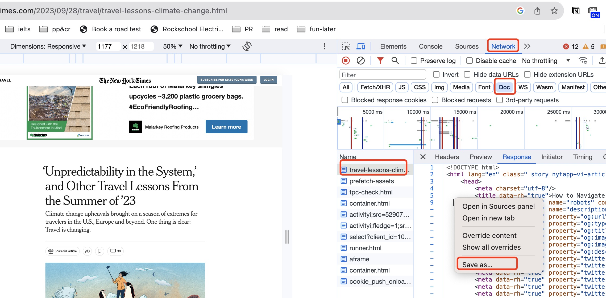
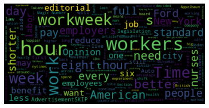
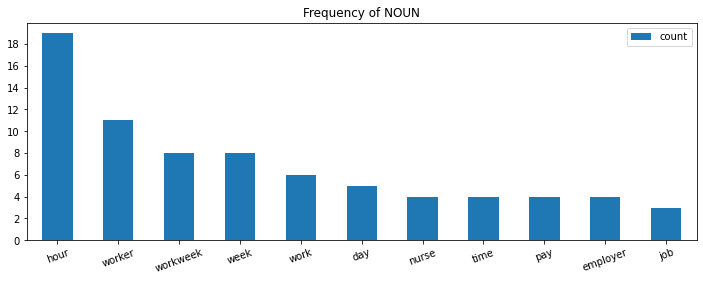
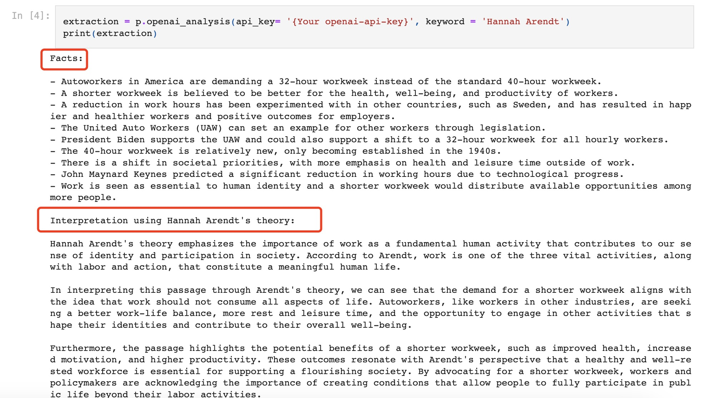

# Passage Analysis Tool

## What is it?
The Passage Analysis Tool is a versatile utility designed for in-depth analysis of textual passages. It offers the following key features:
- **HTML Text Extraction**: Easily extract text from HTML documents.
- **Wordcloud Generation**: Create word clouds to visualize frequently occurring words.
- **Part-of-Speech (POS) Frequency Count**: Categorize words by parts of speech (e.g., adjectives, adverbs, nouns, verbs) and analyze their frequency.
- **Fact Extraction**: Automatically extract important facts from the passage.
- **Idea Interpretation**: Interpret the underlying ideas in the passage based on specific theories.

## Why use it?
I found news articles and lengthy documents often contain an overwhelming amount of information. This tool helps me extract the most important ideas and insights from a passage, allowing me to decide whether to delve deeper. Additionally, it provides a structured way to understand the content.

## How to Use:
You can check the [example](example.ipynb) for usage directly.

1. **Extract Text from HTML**: To begin, download the HTML document containing the text. Modern web pages often use JavaScript, making it challenging to access text directly from the "Page Source." Use browser developer tools (e.g., `inspect - network - doc`) to save the HTML with the text content.

   

   Once you have the HTML file, import the package and create a PassageAnalize object:
   ```python
   from passage_analysis import PassageAnalyze
   p = PassageAnalyze("html.txt")
   ```
   My `html.txt` is based on the news [The Magic Number: 32 Hours a Week](https://www.nytimes.com/2023/09/27/opinion/editorials/uaw-strike-workweek-hours.html) at The New York Times.

2. **Generate Wordcloud**:
   If you want to create a word cloud visualization, simply use the `wordcloud()` method:
   ```python
   word_cloud = p.wordcloud()
   ```

   

3. **Part-of-Speech (POS) Analysis**:
   You can analyze word frequency by part-of-speech categories, including adjectives (ADJ), adverbs (ADV), nouns (NOUN), and verbs (VERB), among others. See [universal dependencies](https://universaldependencies.org/u/pos/) for more POS tags. The words are **lemmatized**, which means different tenses or persons are normalized to the original one.
   ```python
   nouns = p.text_analysis('NOUN')  # Check nouns
   # verbs = p.text_analysis('VERB')  # Check verbs
   ```

   

   

5. **Extract Facts and Interpret Ideas**:
   This tool can extract facts from the passage and interpret the underlying ideas using a specific theory. To do this, you need to have an OpenAI API key and specify the theory to use.
   ```python
   extraction = p.openai_analysis(api_key='{Your openai-api-key}', keyword='Hannah Arendt')
   print(extraction)
   ```

   
